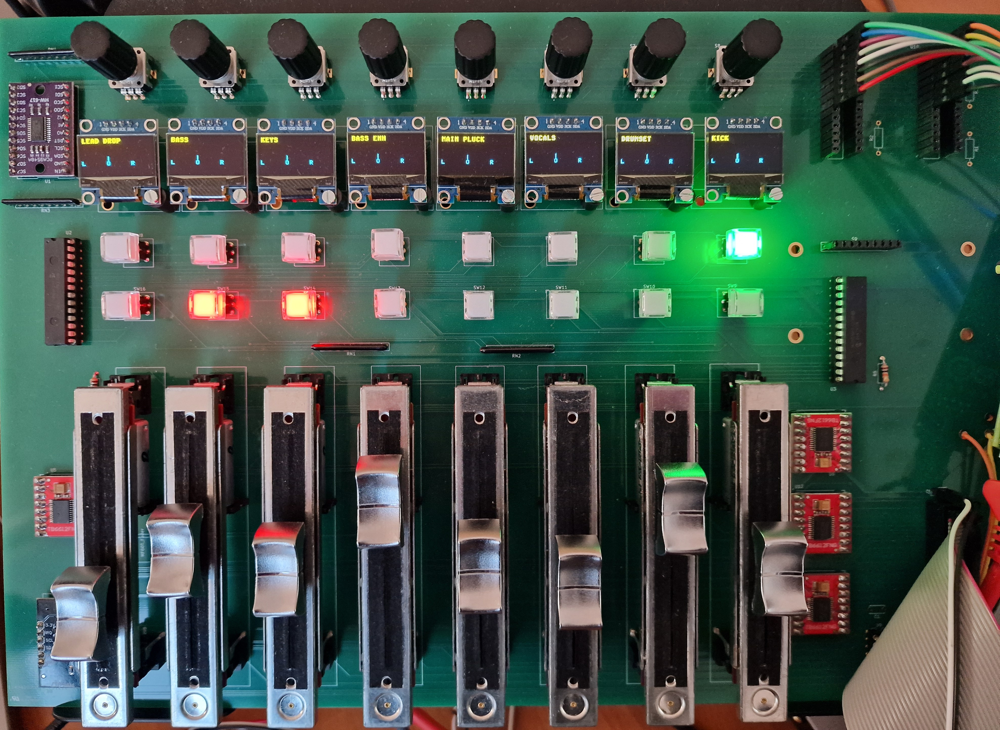
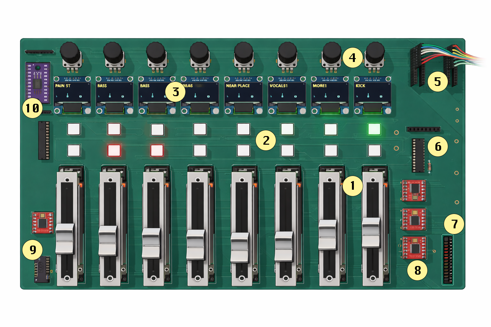
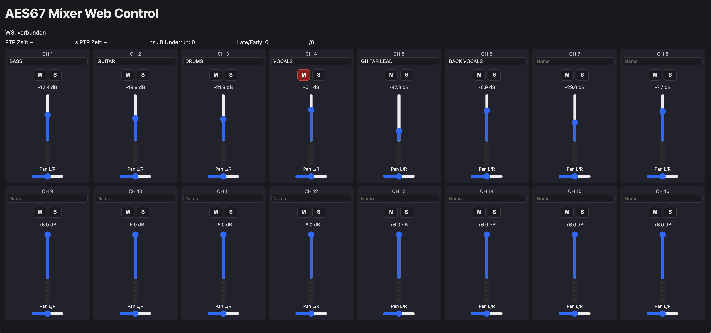

# FPGA Digital Audio Mixer with Network Control



This project implements a digital audio mixer on Intel Cyclone 10 LP FPGA with AES67 RTP network audio (48 kHz, 24-bit L24 format).
Local control is provided by a custom PCB with motorized faders (capacitive touch), buttons, rotary knobs and per-channel OLED displays.
Additionally there is a web frontend for remote control.
All code runs purely on hardware for maximum performance, there is no soft-core or any other microcontroller involved.

**Table of Contents**
1. [Hardware Components](#hardware-components)
2. [System Overview](#system-overview)
3. [Architecture & Clock Domains](#architecture--clock-domains)
4. [Detailed Module Specifications](#detailed-module-specifications)
5. [Signal Formats & Data Paths](#signal-formats--data-paths)
6. [Configuration Parameters](#configuration-parameters)

---

## Hardware Components

### Intel Cyclone 10 LP Development Board
The heart of the digital audio mixer is the Intel Cyclone 10 LP Evaluation Kit. This platform was selected as it provides a few significant benefits:

* sufficient large Cyclone 10 FPGA to implement network, audio and control functionality
* ingegrated 1G network port
* a large number of input / output pins
* on-board JTAG programmer and debugger
* acceptable price of around 100 EUR

### Control Board Bill of Materials (BOM)
The custom control surface communicates with the FPGA via a 40-pin GPIO ribbon cable and some more dedicated cables. The board has been designed with KiCad. For the first production batch, I did not take special care of analog signal routing for the ADC for the faders and touch. It works in my environment, however, for the next production run maybe someone with more experience on that could give some hints on the layout ;-)

For this design I selected 60 mm faders, as the board would have become too big with the 100 mm faders. I tried to avoid using SMD components in this early design phase to make manual corrections easy and only used pre-built modules that can be either stacked into sockets or soldered directly.

| Component | Part Number | Quantity | Function |
| :--- | :--- | :--- | :--- |
| **Motorized Faders** | **MF60T** | 8 | Behringer 60 mm standard 10k Linear |
| **Motor Drivers** | **TB6612** (Dual) | 4 | PWM-based motor driver for 8 fader motors |
| **Touch Sensor** | **MPR121** | 1 | Capacitive touch detection |
| **I2C Multiplexer** | **PCA9548** | 1 | Individual addressing for the 8 OLED displays |
| **OLED Displays** | **128x64 I2C** | 8 | Per-channel labels, Pan, and Peak Meters |
| **Port Expander** | **MCP23017** | 1 | Driving LEDs for Mute and Solo buttons |
| **Rotary Encoders** | **STEC12** | 8 | Pan control |
| **Connectors** | 40-pin IDC | 1 | Main interface to the FPGA development board |

---

## Network & Protocol Implementation

### AES67 & SDP
The mixer adheres to the **AES67 standard** for interoperability with professional Audio-over-IP (AoIP) ecosystems.

* **Fixed Parameters:** To maintain a pure hardware implementation, the stream is fixed at **48 kHz, 24-bit (L24 format)**.
* **Session Description Protocol (SDP):** A static SDP file is provided to define multicast addresses, ports, and payload types, allowing external receivers to subscribe to the mixer's output.

### Multicast & Switch Strategy
The system utilizes **IP Multicast** for efficient one-to-many audio distribution.

* **Simplified Implementation:** To reduce FPGA gate usage and complexity, the design **does not implement IGMP Join/Leave messages**. 
* **Network Requirement:** Because the hardware does not actively "announce" its presence via IGMP, the network switch must be configured for **Static Multicast** or allowed to flood the multicast traffic to the target ports. This trade-off allows for a significantly leaner RTL network stack and is absolutely sufficient for hoem or small studio environments.

### Network Configuration

Since this project implements a pure hardware UDP/IP stack, IP addresses are currently **hardcoded** in the RTL to ensure maximum performance and zero-config startup.

**Current Default Settings**
My DANTE network has the IP range 192.168.1.0/24. By default, the project is configured with the following static IP addresses:

| Parameter | Default Value | Description |
| :--- | :--- | :--- |
| **Mixer IP Address** | `192.168.1.128` | The static IP of the FPGA board |
| **Frontend Server IP Address** | `192.168.1.100` | The static IP of the python server that receives the status messages |
| **Subnet Mask** | `255.255.255.0` | Standard Class C subnet |
| **Gateway** | `192.168.1.1` | Default network gateway |
| **Multicast Group** | `239.69.1.2` | Destination for AES67 RTP audio streams |
| **RTP Port** | `5004` | Standard port for RTP audio |

**How to Change IP Addresses**
If your network environment uses a different subnet, you must update the addresses in the source code before recompiling in Quartus.

1. **FPGA RTL (Hardware):**
   Look for the hexadecimal representation of the IP:
   * Example: `32'hC0A80164` corresponds to `192.168.1.100`.
   
2. **Web Frontend:**
   Open the `frontend/config.js` (or similar configuration file in the `/frontend` directory).
   Update the `MIXER_IP` constant to match the address set in the FPGA:
   ```javascript
   const MIXER_IP = "192.168.1.128";

## System Overview

### Board

The following figure shows the elements on the custom mixer control baord. The control board is powered with 3,3V from the FPGA board and has an additional 9V power supply for the fader motors.

**Board Picture**



#### 1. Fader

Each channel features a motorized linear fader at the bottom of the panel.
It is used to control the channel level (volume). The motorization allows the fader to move automatically to reflect external control from the web interface.

#### 2. Mute / Solo Buttons

Above each fader there are illuminated push buttons:

- Mute: Instantly silences the corresponding channel when activated.
- Solo: Isolates the channel for monitoring, muting all other channels depending on the solo mode.

The LED backlighting provides immediate visual feedback about the current state (active/inactive).

#### 3. OLED Display

Each channel has a small OLED display positioned above the buttons.
The display shows channel-related information, such as:

- Channel or track name
- Pan position (L / C / R)
- Pre-fader input meter

#### 4. Pan Rotary Knob

At the top of each channel strip there is a rotary encoder (pan knob).
It is used to adjust the stereo pan position, placing the signal anywhere between the left and right output channels.
Because it is an encoder rather than a simple potentiometer, it supports precise digital control and remote control.

#### 5. Rotary connector

Initially I intended to use port extenders for the rotary encoders. 
However, during development it turned out that the extenders are too slow for quick movements of the encoders and debouncing was hard.
So I changed the setup and connected the encoders directly to the FPGA, which allows flexible debounce and stable and quick detection. 

#### 6. MCP23017 port extenders

The port extenders are used for the LED buttons.

#### 7. Main PCB connector

A 40 pin ribbon cable connects the board to the FPGA system.

#### 8. TB6612 motor drivers

In total 4 motor drivers are on the board for the 8 fader channels.

#### 9. MPR121 capacitative touch

The touch IC detects if a fader knob is touched and motor control is disabled for this channel.

#### 10. PCA9548 I2C multiplexer

The I2C multiplexer is used for the 8 OLED displays.

### Web frontend



The web frontend implements the same controls that are available on the local control interface.
It can sends updates to the mixer and receives regular status updates from the FPGA main mixer system.

### Core Subsystems

**Audio Subsystem**
- 16-channel input mixer with independent gain, pan, mute, and solo per channel (current demo system uses 8 channels)
- 2-channel stereo output (summed from 16 inputs with pan law)
- AES67 RTP network audio receive (UDP port 5004)
- Optional network audio transmit capability
- Adaptive jitter buffer with clock drift compensation
- Peak detection and hold/decay metering

**Timing Subsystem**
- IEEE 1588 (PTP v2) clock synchronization to master device
- Automatic 48 kHz audio clock generation locked to master timing
- PI servo controller for precise frequency tracking
- Anti-windup and wrap-safe counter management

**Network & Telemetry**
- UDP status packet streaming (port 7880) with complete mixer state snapshot
- Packet includes peaks, pan, gain, mute/solo, channel names, jitter buffer status
- Optional SDP (Session Description Protocol) announcements for device discovery

### Included Libraries

#### verilog-ethernet

The project relies on the UDP / Ethernet implementation made by Alex Forencich.
It is available here: https://github.com/alexforencich/verilog-ethernet

#### verilog-i2c

For the I2C communication, the i2c-master from verilog-12c by Alex Forencich is used.
It is available here: https://github.com/alexforencich/verilog-i2c/tree/master

#### spdif

A working SPDIF transmitter, which I have tried with this project can be found here:
https://ackspace.nl/wiki/SP/DIF_transmitter_project

---

## Architecture & Clock Domains

### Multi-Clock System Design

The FPGA uses three synchronized but independent clock domains:

```
┌─────────────────────────────────────────────────────────────┐
│                    Ethernet PHY (1000BASE-T)                │
│                         RGMII Interface                     │
└────────────────────────────┬────────────────────────────────┘
                             │
        ┌────────────────────┼────────────────────┐
        │                    │                    │
        ↓                    ↓                    ↓
    125 MHz             50 MHz Primary       12.288 MHz SPDIF
  Ethernet Clock      Control Clock          Output Clock
    (Network)          (Mixed Signal)         (Audio Output)
        │                    │                    │
        ├─ UDP/IP Stack      ├─ Audio Mixer      └─ SPDIF Output
        ├─ RTP Parsing       ├─ Fader Control       Encoding
        ├─ PTP Reception     ├─ Button Input
        ├─ Packet Routing    ├─ OLED Display
        └─ Network Timing    └─ Status Capture
                             
```

### Clock Domain Crossing Strategy

**Safe data transfer between domains:**

| Crossing | Method | Module | Purpose |
|---------|--------|--------|---------|
| 125 MHz → 50 MHz | Async FIFO | `axis_udp_payload_async_fifo.v` | UDP packet payload buffering |
| 50 MHz → 125 MHz | Async FIFO | `tx_asyncfifo10b_axi.v` | Network transmit path |
| 48 kHz ↔ 50 MHz | Custom FIFO | `jitter_buffer_dcfifo_resampler.v` | Audio buffering with resampling |

### System Hierarchy

```
fpga.v (Top-Level Wrapper)
├── PLL (generates 50M, 12.288M from 125M input)
├── Reset Synchronizers (async reset → sync reset per domain)
│
└── fpga_core.v (Main Integration)
    │
    ├── Ethernet MAC Layer (verilog-ethernet library)
    │   ├── RGMII RX/TX (125 MHz physical interface)
    │   ├── Ethernet MAC (address filtering, CRC)
    │   └── ARP and basic management
    │
    ├── IP & UDP Stack (verilog-ethernet library)
    │   ├── IPv4 header processing
    │   ├── UDP demultiplexer (4 ports: 319, 320, 5004, 7880)
    │   ├── UDP transmit aggregator
    │   └── Checksum generation
    │
    ├── PTP Client Implementation
    │   ├── ptp_client_stream_50m: Sync message reception
    │   ├── ptp_v2_sync_follow_parser_stream: Timestamp extraction
    │   ├── ptp_client_servo_light_wrapsafe_dbg: PI servo (KP=0.5, KI=0.001)
    │   └── ptp_timebase_slew: 48 kHz generation with slew-rate limiting
    │
    ├── Audio Processing Path (50 MHz → 48 kHz)
    │   ├── aes67_rtp_rx_fifo: UDP → RTP packet parsing
    │   ├── jitter_buffer_dcfifo_resampler: Adaptive buffering + resampling
    │   ├── mixer_16x2_q14_pipelined_patched: 3-stage pipelined 16×2 mixer
    │   ├── pan_gain_coeff_calc16_rom: Pan law coefficient lookup (256-entry ROM)
    │   └── aes67_tx_stream2_from_fifo48_lr: RTP packet generation (optional output)
    │
    ├── Control Interface Subsystem (50 MHz)
    │   │
    │   ├── Fader Motor Control
    │   │   ├── mcp3008_rr: 8-channel SPI ADC round-robin scanner (100 kHz SPI)
    │   │   ├── fader_channel_logic_10b_int: Per-channel PI servo (Kp=0.5, Ki=0.03)
    │   │   └── mixer_top_8ch: Orchestrator (PWM @ 20 kHz to TB6612 drivers)
    │   │
    │   ├── Button Input (16 buttons via 2× MCP23017)
    │   │   ├── mcp23017_dual_ctrl: I2C GPIO read (2 ms poll interval)
    │   │   └── mcp_buttons_toggle_plus_solo: Debounce + toggle/solo logic
    │   │
    │   ├── Touch Sensing (8 sensors via MPR121)
    │   │   └── mpr121_poll8_simplified-v2: I2C polling (1 ms interval)
    │   │
    │   └── Rotary Encoders (8 channels, quadrature decoding)
    │       └── rotary8_stec12e08_debounced: Quadrature phase detection
    │
    ├── Display & Monitoring System (50 MHz)
    │   ├── oled_mixer8_ssd1306_tca9548_axis: 8-display controller (20 ms refresh)
    │   │   ├── TCA9548 I2C multiplexer (1-of-8 channel selection)
    │   │   ├── Name
    │   │   ├── Peak meter rendering (12 segments, hold/decay)
    │   │   └── Pan indicator visualization
    │   │
    │   ├── name_ram_1w2r: 1-write, 2-read BRAM (256×8, dual independent reads)
    │   ├── name_dp_ram: Dual-port BRAM building block
    │   └── font7x12_pages_bram: Font storage (1536 bytes, M9K BRAM)
    │
    ├── Status & Telemetry
    │   ├── udp_status_tx_bram: Status capture (424-byte snapshot per cycle)
    │   ├── sdp_udp_stream_from_rom: SDP announcer (periodic broadcast)
    │   └── udp_debug_tx: Optional debug streaming
    │
    ├── Network Routing
    │   ├── udp_port_demux_4: 4-way input routing (fixed priority)
    │   └── udp_tx_mux4_from_streams_clean: 4-way output arbitration (priority 0>1>2>3)
    │
    └── Clock Domain FIFOs
        ├── axis_udp_payload_async_fifo: 8-bit, 512 deep (125M→50M crossing)
        ├── tx_asyncfifo10b_axi: 10-bit, 4096 deep (50M→125M crossing)
        ├── custom_async_fifo: 48-bit, 512 deep (general purpose)
        ├── net_async_fifo_10b: 10-bit, 4096 deep (packet format {start,end,data})
        ├── aes67sendfifo: 50-bit, 256 deep (audio tx buffering)
        └── sdebug_async_fifo: 8-bit, 4096 deep (debug streaming)
```

---

## Detailed Module Specifications

### 1. Audio Mixer Core

#### `mixer_16x2_q14_pipelined_patched.v` - Main Mixing Engine

**Purpose**: Combine 16 independent audio channels into stereo output with configurable gain, pan, mute, and solo.

**Architecture**:
```
3-Stage Pipeline (16 channels):
    24-bit signed samples (Q.23 format, range: -2^23 to +2^23-1)
        │
        ├─ Register Inputs (Stage 0)
        │  └─ 32 x Q.14 coefficients (left + right)
        │  └─ 16 x 24-bit sample
        │
        ├─ Multiplication (Stage 1)
        │  └─ 32 x 40 bit product
        │  ├─ Left: sample × left_coeff (Q.14)
        │  └─ Right: sample × right_coeff (Q.14)
        │
        ├─ Accumulation (Stage 2) - Adder Tree Part 1 (group of 4)
        │  ├─ 4 x Summed_Left = Σ(product(0*i:3*i))
        │  └─ 4 x Summed_Right = Σ(product(0*i:3*i))
        │
        └─ Final Result + Bus Headroom Attenuation (Stage 3)
           ├─ Applied to prevent overflow (16 inputs can sum to large value)
           ├─ Configurable: BUS_HEADROOM_BITS = 2 (default ~12 dB reduction)
           └─ Result: 32-bit signed, will be reduced to 24 bit output

```

---

### 2. Jitter Buffer with Adaptive Resampling

#### `jitter_buffer_dcfifo_resampler.v` - Clock Drift Compensation

**Problem**: Network clock drifts relative to local audio clock. Without compensation, audio playback speed varies, causing buffer underrun/overflow and audible artifacts.

**Solution**: Adaptive resampling that inserts or skips samples to maintain stable buffer fill level.

**Algorithm**:
```
Every 48 kHz sample period:

1. Monitor FIFO Fill Level
   ├─ read_ptr vs write_ptr difference
   ├─ Target: 50% fill (balanced state)
   └─ Thresholds: 25% (LOW), 75% (HIGH)

2. Decision Logic
   ├─ if fill < 25%: insert duplicate sample (slow playback)
   ├─ if fill > 75%: skip next sample (speed up playback)
   └─ else: pass through normally

3. Output Processing
   ├─ 2-sample moving average (smooths discontinuities)
   └─ Peak detection (track max absolute value)

4. Peak Hold/Decay (for display metering)
   ├─ Hold window: 800 ms (maintain peak visibility)
   ├─ Decay: 500 ms duration from peak capture to silence
   └─ Used for OLED peak meter visualization
```

**Example - 0.5% Clock Drift Compensation**:

```
Network clock 0.5% faster than local audio clock

Without jitter buffer:
├─ T=0s: FIFO 50% full (balanced)
├─ T=5s: FIFO 60% full (network supplying faster)
├─ T=10s: FIFO 70% full
├─ T=15s: FIFO 80% full → overflow, audio quality degradation
├─ T=20s: Complete overflow, digital noise in output

With adaptive resampling:
├─ T=0s: FIFO 50% full
├─ T=5s: FIFO reaches 75% → start skipping samples
├─ Skip rate: ~0.5% of samples (1 every 200)
├─ T=10s: FIFO stabilized at 70-75% range
├─ T=20s: Still stable, imperceptible audio quality (slight pitch variation)
├─ T=100s: FIFO maintains stability indefinitely
└─ Result: No dropouts, system handles wide range of clock drift
```

**Parameter Tuning**:
```verilog
parameter integer INSERT_THRESH_LOW = 64;   // ~25% of 256-entry FIFO
parameter integer INSERT_THRESH_HIGH = 192; // ~75% of 256-entry FIFO
```

---

### 3. Network Timing (PTP v2 Synchronization)

#### `ptp_client_servo_light_wrapsafe_dbg.v` - Clock Synchronization Controller

**Purpose**: Continuously adjust 48 kHz audio clock frequency to match master clock via PTP feedback.

**PI Servo Algorithm**:
```
Control Loop (updated ~1 Hz from PTP messages):

Input: Time error = local_clock - master_clock (nanoseconds)

Proportional Term:
    P = error × Kp
    where Kp = 0.5 (corrects ~50% of error in current period)
    
Integral Term (with anti-windup):
    I_new = I_old + error × Ki
    where Ki = 0.001 (slow accumulation over hours)
    
    Anti-windup limits:
        if I > +200 PPM: I = +200 PPM
        if I < -200 PPM: I = -200 PPM

Total Output:
    frequency_adjust = P + I  (in PPM: parts per million)
    
Applied to Clock:
    current_period = nominal_period + adjust_per_cycle
    (affects 48 kHz timebase frequency)
```
---

### 4. Control Interfaces

#### 4.1 Motorized Fader System

##### `mcp3008_rr.v` - ADC Round-Robin Scanner

**Purpose**: Read 8 analog fader positions via SPI every ~500 µs.

**MCP3008 Specifications**:
- 8 single-ended analog inputs (0V to 3.3V)
- 10-bit resolution (1024 levels, ~3.2 mV/step)
- SPI clock rate: 400 kHz (configurable)
- Differential or single-ended mode

**Round-Robin Scanning**:
```
Timing (400 kHz SPI):
├─ 3 bytes × 8 bits = 24 SPI clocks
├─ At 400 kHz: 60 µs per channel
├─ 8 channels: ~480 µs cycle time
└─ Fast enough for effective sample rate: ~2 kHz per channel
```

##### `fader_channel_logic_10b_int.v` - Motor Servo Controller

**Purpose**: PI servo loop adjusts motor to match target fader position.

**PI Servo (per-channel)**:
```
Target position (from mixer gain control) vs. Measured position (from ADC)

Error = Target - Current  (10-bit values, range: -1024 to +1023)

Proportional term:
    P = error × 0.5  (Kp=0.5)
    
Integral term (with anti-windup):
    I += error × 0.03  (Ki=0.03)
    if I > 1024: I = 1024  // limit integrator
    if I < -1024: I = -1024
    
Output (PWM control):
    output = P + I
    
    if output > 0: move up   (M_IN1=1, M_IN2=0, PWM=output)
    if output < 0: move down (M_IN1=0, M_IN2=1, PWM=|output|)
    if output = 0: idle      (both inputs = 0, PWM = 0)
```

**Soft Landing (Motor Ramp-Down)**:
```
When faders_en[ch] transitions from 1 to 0:
├─ Gradually reduce PWM duty:
│  ├─ Cycle 0: 100% PWM
│  ├─ Cycle 1: 95% PWM
│  ├─ Cycle 2: 90% PWM
│  └─ ...
│  └─ Cycle 20: 0% PWM (motor stops)
│
├─ Duration: 20-50 ms (configurable)
├─ Prevents mechanical click/pop sound
└─ Smooth coasting to stop
```

**Typical Response** (step change 512→768):
```
Time    Error    P        I        Output    Motor Action
─────────────────────────────────────────────────────────
0 ms    256      128      0        128       Strong PWM up
10 ms   180      90       15       105       PWM up (decelerating)
30 ms   60       30       25       55        Moderate PWM
50 ms   10       5        28       33        Light PWM
70 ms   5        2.5      29       31.5      Very light (oscillating)
100 ms  ±1       ±0.5     30       ±0.5      Steady state (hunting <1 position)
```

---

#### 4.2 Button Control

##### `mcp_buttons_toggle_plus_solo.v` - Button Logic

**Purpose**: Debounce button matrix and implement mute/solo state machines.

**Button Mapping** (16 buttons total):
```
Buttons 8-15: Mute controls (independent toggle per channel)
    ├─ Button 8 = Mute Channel 0
    ├─ Button 9 = Mute Channel 1
    └─ ...
    
    Logic per channel:
    ├─ On press: mute[ch] = NOT mute[ch]  (toggle)
    └─ Held: no additional action (edge-triggered)

Buttons 0-7: Solo controls (one-hot with toggle-off)
    ├─ Button 0 = Solo Channel 0
    ├─ Button 1 = Solo Channel 1
    └─ ...
    
    Logic:
    ├─ If solo[ch] = 0 (not currently solo):
    │  └─ On press: solo[ch] = 1, all others = 0  (make solo)
    │
    ├─ If solo[ch] = 1 (already solo):
    │  └─ On press: solo[ch] = 0, all others = 0  (toggle off = cancel solo)
    │
    └─ Result: mutual exclusion, press same button to cancel
```

**Important** 

The board layout unfortunately has an issue with button to MCP23017 port assignment. 
So, e.g., MCP port 1 is not equal to Channel 1!
That does not reflect the operation, but needs to be considered when assigning the ports to logic.

**Debounce FSM** (per button):
```
State Machine:
├─ STABLE (20 ms)
│  ├─ Input stable for debounce time
│  ├─ If input changes: transition to DEBOUNCE state
│  └─ Output = current stable value
│
└─ DEBOUNCE (countdown N cycles, typically N=20 @ 1 kHz sampling)
   ├─ Button bouncing, ignore changes
   ├─ After N cycles: transition to STABLE
   └─ Sample new stable input value
   
Result: 20 ms minimum time between state changes
        eliminates contact bounce (typical 5-15 ms)
```

##### `mcp23017_dual_ctrl.v` - I2C GPIO Expander

**Purpose**: Interface 2 MCP23017 16-bit GPIO expanders for button inputs and LED outputs.

**Device Configuration**:
```
Device 0 @ I2C Address 0x22:
├─ Port A (0x00): 8 LEDs (solo indicators) - OUTPUT
└─ Port B (0x01): 8 buttons (solo controls) - INPUT with pull-ups

Device 1 @ I2C Address 0x23:
├─ Port A (0x00): 8 LEDs (mute indicators) - OUTPUT
└─ Port B (0x01): 8 buttons (mute controls) - INPUT with pull-ups
```

---

#### 4.3 Touch Sensors

##### `mpr121_poll8_simplified-v2.v` - Capacitive Touch Controller

**Purpose**: Poll 8-channel capacitive touch sensor via I2C with configurable thresholds.

**MPR121 Features**:
- 8 independent electrode inputs
- Automatic baseline tracking (compensates for temperature, humidity drift)
- Configurable touch and release thresholds
- I2C interface (400 kHz standard mode)

**Initialization Sequence** (on power-up):
```
Step 1: Soft Reset
    └─ I2C write to address 0x5A, register 0x80 (SRST)
       └─ Value = 0x63 (magic reset command)
       └─ Clears all configuration, sets defaults

Step 2: Configure Thresholds (per electrode)
    └─ Touch Threshold Registers (0x41-0x4E):
       └─ Value = TOUCH_TH (default 20 counts)
       
    └─ Release Threshold Registers (0x4F-0x5C):
       └─ Value = RELEASE_TH (default 10 counts)
       
    Thresholds set detection sensitivity
    ├─ Lower values: more sensitive (false trigger risk)
    ├─ Higher values: less sensitive (miss real touches)
    └─ Hysteresis = TOUCH_TH - RELEASE_TH (typical 10 counts)

Step 3: Enable Electrodes
    └─ ECR Register (0x5E) = 0x88
       ├─ Enable all 8 electrodes
       ├─ Set baseline update to 0.5 second window
       └─ Start touch sensing

Step 4: Start Polling
    └─ Continuous I2C reads of touch status
```

**Threshold Adjustment**:
```
Default (balanced for typical environment):
├─ TOUCH_TH = 20 counts (above baseline)
├─ RELEASE_TH = 10 counts (below touch threshold)
└─ Hysteresis = 10 counts (prevents oscillation)

For less sensitive (avoid false triggers):
├─ TOUCH_TH = 30-50 counts
└─ RELEASE_TH = 15-25 counts

For more sensitive (detect light touches):
├─ TOUCH_TH = 5-10 counts
└─ RELEASE_TH = 2-5 counts

Note: MPR121 continuously updates baseline (tracks slow drifts)
      Thresholds are relative to dynamic baseline
```

---

#### 4.4 Rotary Encoders

##### `rotary8_stec12e08_debounced.v` - Quadrature Decoder

**Purpose**: Decode STEC12E08 rotary encoder outputs to directional pulses.

**Quadrature Encoding**:
```
Incremental Rotary Encoder Output:

Physical Setup:
├─ Channel A: regular pulse output
├─ Channel B: same frequency, 90° phase offset
├─ Frequency: depends on rotation speed (2-100 Hz typical)

Phase Relationship (one complete cycle, rotating clockwise):
    A→B (A low, B high): Clockwise increment
    B→A (A high, B low): Counter-clockwise decrement
```

**Debounce & Decode Algorithm**:
```
Per-channel state machine:

Debounce Stage:
    └─ 4-stage shift register per channel:
       ├─ shift[0] = current raw input
       ├─ shift[1] = 1 cycle old
       ├─ shift[2] = 2 cycles old
       ├─ shift[3] = 3 cycles old
       
       Valid transition when all 4 match:
       └─ if (shift[0] == shift[1] == shift[2] == shift[3]):
              stable_input = shift[0]
              
       Debounce window: 4 cycles @ 50 MHz ≈ 80 ns
       Practical rejection: >100 ns glitches

Phase Decoder:
    ├─ Track previous phase: (last_a, last_b)
    ├─ Detect transitions:
    │  ├─ A rising (0→1) + B=1: clockwise → emit pulse_cw
    │  ├─ B rising (0→1) + A=1: counter-clockwise → emit pulse_ccw
    │  └─ Otherwise: no transition
    │
    └─ Output: 1-cycle pulse per transition
       ├─ pulse_cw[ch] = 1 (one cycle)
       ├─ pulse_ccw[ch] = 0
       └─ Next transition: new pulse
```

**Output Format**:
```verilog
output [7:0] pulse_cw;      // 1-cycle pulse per clockwise count
output [7:0] pulse_ccw;     // 1-cycle pulse per counter-clockwise count

// Application usage:
// On pulse_cw[ch]:   pan[ch]++ (increase)
// On pulse_ccw[ch]:  pan[ch]-- (decrease)
```

---

### 5. Display System

#### 5.1 OLED Display Controller

##### `oled_mixer8_ssd1306_tca9548_axis.v` - Multi-Display Manager

**Purpose**: Drive 8 independent OLED displays with real-time channel status (names, peaks, pan).

**Hardware Architecture**:
```
Single I2C Bus (400 kHz)
    │
    ├─ TCA9548 I2C Multiplexer (address 0x70)
    │  ├─ Channel 0: SSD1306 Display 0 (address 0x3C)
    │  ├─ Channel 1: SSD1306 Display 1 (address 0x3C)
    │  ├─ Channel 2: SSD1306 Display 2 (address 0x3C)
    │  ├─ ... 
    │  └─ Channel 7: SSD1306 Display 7 (address 0x3C)

All displays at same I2C address (0x3C) but on different
TCA9548 channels (only one channel active at a time)
```

**Display Refresh Cycle** (every METER_MS = 20 ms):
```
Refresh all 8 displays in round-robin:

Display[0]:
├─1. Select via TCA9548 (write 0x70 with 0x01)
│   └─ 1 byte I2C: ~20 µs
│
├─2. Render Channel Name
│   ├─ **Only if dirty to save time for meter**
│   ├─ Read 8 characters from name_bram
│   ├─ For each character:
│   │  ├─ Look up 7×12 glyph from font ROM
│   │  ├─ Convert to SSD1306 format (8 pixels per byte)
│   │  └─ Send to display
│   └─ Total: ~100 bytes
│
├─3. Render Pan Indicator
│   ├─ **Only if dirty to save time for meter**
│   ├─ Position: right side (page 2-7, column 112-127)
│   ├─ Pan range: -128 to +127 (left to right)
│   ├─ Visual: centered indicator showing pan position
│   ├─ Mapping: center (-64 to +64 → columns 0-15)
│   └─ Size: 2-pixel wide indicator marker
│
├─4. Render Peak Meter
│   ├─ Position: left side (page 2-7, column 0-15)
│   ├─ Meter: 12 vertical segments (4 px high + 1 px gap each)
│   ├─ Peak value (Q.15) maps to filled height:
│   │  ├─ 0 dBFS (0x7FFF) = full 12 segments
│   │  ├─ -6 dBFS (0x4000) = 10 segments
│   │  ├─ -12 dBFS (0x2000) = 8 segments
│   │  └─ -∞ dBFS (0x0000) = 0 segments
│   │
│   ├─ Peak hold: display peak with ~800 ms hold time
│   ├─ Decay: gradually reduce visible peak after hold
│   └─ Rendering: fill segments from bottom to peak
│
└─5. Update Display
    └─ SSD1306 internal latch updates

```

**Peak Meter Calculation**:
```
Input: 16-bit signed audio sample (Q.15 format)
Range: -32768 to +32767 (representing -1.0 to +0.9999)

Process:
1. Absolute value: abs_val = |sample|

2. Convert to dB:
   if abs_val > 0:
       dB = 20 × log10(abs_val / 32767)
   else:
       dB = -∞

3. Map dB to meter segments (0-12):
   Typical mapping:
   ├─ 0 dBFS:   full (segment 12)
   ├─ -6 dBFS:  80% (segment 10)
   ├─ -12 dBFS: 65% (segment 8)
   ├─ -18 dBFS: 50% (segment 6)
   ├─ -24 dBFS: 35% (segment 4)
   ├─ -30 dBFS: 20% (segment 2)
   └─ -36 dBFS: 0% (segment 0)

4. Peak hold: remember max segment seen in last 800 ms

5. Decay: if 500 ms has passed since peak, gradually lower
```

**Pan Indicator Rendering**:
```
Input: Signed 8-bit pan value (-128 to +127)

Mapping:
├─ -128: full left (display column 0)
├─ -64:  left center (display column 4)
├─ 0:    center (display column 8)
├─ +64:  right center (display column 12)
└─ +127: full right (display column 15)

Visual:
├─ 16-pixel wide display area
├─ 2-pixel wide indicator marker
├─ Vertical position: center of meter area
└─ Updates in real-time with pan changes
```

#### 5.2 Channel Name Memory

##### `name_ram_1w2r.v` - Dual-Read BRAM

**Purpose**: Store channel names with simultaneous dual independent reads.

```verilog
// Configuration:
// Depth: 256 locations (supports 16 channels × 16 characters)
// Width: 8 bits per location (one ASCII character)
// Write Port A: 1 writer @ 50 MHz (system control)
// Read Port B: 2 independent read ports

// Address Mapping:
// Channel 0: addresses 0x00-0x0F
// Channel 1: addresses 0x10-0x1F
// ...
// Channel 7: addresses 0x70-0x7F

// Example initialization file (names.hex):
// 00: 43 48 20 30 20 20 20 20  // "CH 0    "
// 08: 43 48 20 31 20 20 20 20  // "CH 1    "
// 10: 4D 49 43 20 4C 20 20 20  // "MIC L   "
// 18: 4D 49 43 20 52 20 20 20  // "MIC R   "
// ...
```

##### `font7x12_pages_bram.v` - Character Font Storage

**Purpose**: Store monospace 7×12 pixel glyphs for 128 ASCII characters.

```
Font Organization:
├─ Support: 128 ASCII characters (0x00-0x7F)
├─ Resolution: 7 pixels wide × 12 pixels tall per glyph
├─ Format: 2 pages (6 bytes per page = 12 bytes total per glyph)
│  ├─ Page 0: rows 0-7 (6 bytes)
│  └─ Page 1: rows 8-11 (6 bytes)
│
└─ Total storage: 128 × 12 bytes = 1536 bytes (fits in M9K BRAM)

Example Character 'A':
├─ Glyph Data (hex):
│  ├─ Row 0: 0xFE (11111110) = "███████ "
│  ├─ Row 1: 0x81 (10000001) = "█     █ "
│  ├─ Row 2: 0x81 (10000001) = "█     █ "
│  ├─ Row 3: 0xFF (11111111) = "███████ "
│  ├─ Row 4: 0x81 (10000001) = "█     █ "
│  └─ ... more rows

ROM Read:
├─ Address = (char_code × 12) + (page × 6) + col_offset
├─ Synchronous read (1-cycle latency)
└─ Output: 8 bits (one byte = 8 vertical pixels)
```

---

### 6. Status & Telemetry

#### `udp_status_tx_bram.v` - Status Snapshot Streamer

**Purpose**: Capture complete mixer state and stream as UDP packet every 20-50 ms.

**Status Packet Structure** (424 bytes):
```
Byte Range   Field                          Format
──────────────────────────────────────────────────────────
0-3          Packet Header                  32-bit sync word
4-5          Packet Type / Version          0x0001 (v1.0)
6-9          Channel Count / Flags          8/16 bit values
10-25        AES67 Status                   16/32 bit register values
             ├─ Underrun                    4 bytes
             ├─ Overwrite                   4 bytes
             ├─ Late                        4 bytes
             └─ Early                       4 bytes

26-57        Per-Channel Peak Values        (16 ch × 16 bytes)
             Channel 0-15:
             └─ Peak magnitude [1:0]:       Q.15 signed (2 bytes)

58-69        PTP Time                       nanoseconds + seconds

70-95        Jitter Buffer Status           2/4 bytes
             ├─ Buffer level:                   
             ├─ SPDIF samples:                  
             ├─ Main samples:                  
             ├─ DUP Count:                     
             ├─ SKIP Count:                     
             └─ ZERO Count:

96-127       Gain Values                    2 bytes      
             └─ 10-bit value

128-143      Pan Values
             └─ Signed 8-bit per channel    1 byte      

144-147      Mute / Solo Mask               
             ├─ Bytes 144-145:              16-bit mute (bit per channel)
             └─ Bytes 146-147:              16-bit solo (bit per channel)

148-403      Channel Names                  
             Channel 0-15:
             └─ 16 ASCII characters per ch  16 bytes

```

---

## Signal Formats & Data Paths

### Audio Sample Format

**24-bit L24 (AES67 Standard)**:
```
Value Range:        -2^23 to +2^23-1 (-8,388,608 to +8,388,607)
Normalized:         -1.0 to +0.9999... (symmetric range)
Bit Width:          24 bits
Fixed-Point Format: Q.23 (1 sign + 23 magnitude)
Dynamic Range:      24 × 6.02 dB/bit ≈ 144 dB

RTP/Network Encoding (3-byte big-endian):
├─ Byte 0 (MSB): bits [23:16]
├─ Byte 1:       bits [15:8]
└─ Byte 2 (LSB): bits [7:0]

```

### Control Signal Formats

**Fader Position** (10-bit ADC):
```
Resolution:    1024 levels
Voltage Range: 0V to 3.3V
ADC Format:    0 (0V) to 1023 (3.3V)
Mapping:       Position → Gain (dB)
               0    → -∞ dB (mute)
               512  → -6 dB (midpoint)
               1023 → +6 dB (full level)

Coefficient Generation:
├─ Gain law: -60 .. -10db (0-60%) / -10dB .. +6dB (60%-100%)
└─ ROM output: {coeff} (Q.14 each)

```

**Pan Control** (8-bit signed):
```
Range:      -128 to +127
Mapping:    -128/-127 → Full Left (right = -∞ dB)
            0         → Center (equal left/right)
            +127      → Full Right (left = -∞ dB)

Coefficient Generation:
├─ Pan law: equal-power (constant loudness at all pan positions)
└─ ROM output: {left_coeff, right_coeff}
```

---

## Configuration Parameters

### Mixer Configuration

```verilog
// mixer_16x2_q14_pipelined_patched.v
parameter integer BUS_HEADROOM_BITS = 2;
// Attenuation per bit: 6 dB
// 2 bits = 12 dB headroom (accommodates 16 inputs summing)
// Tuning: increase for hot mixes, decrease for quiet mixes
//         typical range: 1-3 bits
```

### Control Loop Tuning

```verilog
// Fader Servo (fader_channel_logic_10b_int.v)
parameter integer Kp_mult = 8;      // Kp numerator
parameter integer Kp_div = 16;      // Kp denominator (Kp = 0.5)
parameter integer Ki_mult = 1;      // Ki numerator
parameter integer Ki_div = 32;      // Ki denominator (Ki = 0.03)
parameter integer WINDUP_MAX = 1024; // Integrator limit

// PTP Servo (ptp_client_servo_light_wrapsafe_dbg.v)
parameter real KP = 0.5;            // Proportional (0.3-1.0 range)
parameter real KI = 0.001;          // Integral (0.0001-0.01 range)
parameter integer I_MAX = 200;      // PPM limit (±100 to ±200)

// Jitter Buffer (jitter_buffer_dcfifo_resampler.v)
parameter integer INSERT_THRESH_LOW = 64;   // ~25% fill
parameter integer INSERT_THRESH_HIGH = 192; // ~75% fill
parameter integer HOLD_MS = 800;    // Peak hold (400-1000 ms)
parameter integer DECAY_MS = 500;   // Peak decay (200-1000 ms)
```

### Display Configuration

```verilog
// oled_mixer8_ssd1306_tca9548_axis.v
parameter integer METER_MS = 20;    // Refresh interval (20-50 ms)
parameter integer HOLD_TICKS = 40;  // Peak hold (40 × 20ms = 800ms)
parameter integer DECAY_TICKS = 25; // Peak decay (25 × 20ms = 500ms)
parameter [3:0] SEG_COUNT = 12;     // 12 segments in meter
```


